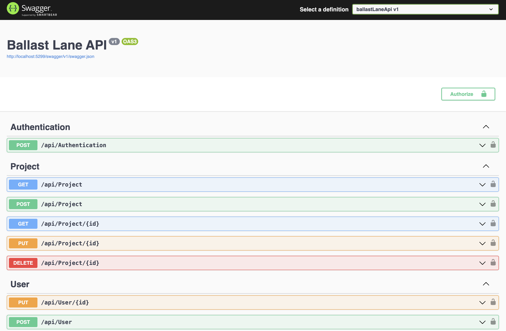

# 🚀 Ballast Lane API

This project is built using the latest .NET stack for managing projects in Ballast Lane. 
It follows Clean Architecture principles and employs Test-Driven Development (TDD) methodologies.

## 👉 Instructions to Run it on Your Local Machine

To run this project on your local machine:

- Clone this repository.
- Open a terminal in the project folder.

## 🔨 Backend

### List of Endpoints

#### Authentication:

###### Example account: (user: user@ballast.com pass: admin123)

- **Login:** `POST http://localhost:port/api/Authentication`

#### Project Endpoints:
- **List Projects:** `GET https://localhost:port/api/projects`
- **Create Project:** `POST https://localhost:port/api/projects`
- **Get Project:** `GET https://localhost:port/api/projects/:id`
- **Update Project:** `PUT https://localhost:port/api/projects/:id`
- **Delete Project:** `DELETE https://localhost:port/api/projects/:id`

#### User Endpoints:
- **Update User:** `PUT https://localhost:port/api/User/{id}`
- **Create User:** `POST https://localhost:port/api/User`

## 💻 Deployment

### With Docker
#### PostgreSQL: Navigate to the project root

> docker-compose up -d

### Run API
#### Navigate to the project root:

> dotnet build

> dotnet run

### Run test
#### Navigate to the project root:
>dotnet test

### Open Swagger
#### You can open the endpoint in the following url:
> http://localhost:5299/swagger/index.html

## 💭 Thoughts During Development

Creating this application was both challenging and rewarding. Initially, defining a clear user story and roadmap was crucial. 

Leveraging the latest .NET version ensured we used modern features, while Clean Architecture enforced strong separation of concerns and improved structure. 

Designing RESTful CRUD operations for users and projects, implementing secure login and token management, and ensuring data integrity with unique constraints were key aspects. 

Containerizing the app with Docker provided consistent environments, particularly when setting up PostgreSQL. Handling dependencies without Entity Framework, Dapper, or Mediator, writing unit tests first to improve code quality, and resolving issues like unique constraint violations enhanced my problem-solving skills. 

This project significantly strengthened my full-stack development skills within the .NET ecosystem, reinforced the importance of best practices, and provided deeper insights into Clean Architecture, TDD, and Docker.

## Author 

## 🎨 **Jasem Valencia**

- Github: [@JasemDuncan](https://github.com/JasemDuncan)
- Twitter: [@JasemValencia](https://twitter.com/JasemValencia)
- Linkedin: [@JasemDuncan](www.linkedin.com/in/Jasem-Duncan-Valencia)

## 🤝 Contributing

    Contributions, issues and feature requests are welcome!

Feel free to check the [issues page](https://github.com/JasemDuncan/Scharff/issues).

## Show your support

Give a ⭐️ if you like this project!

## 📝 License
This project is [MIT](lic.url) licensed.
This project is for Educational purposes.